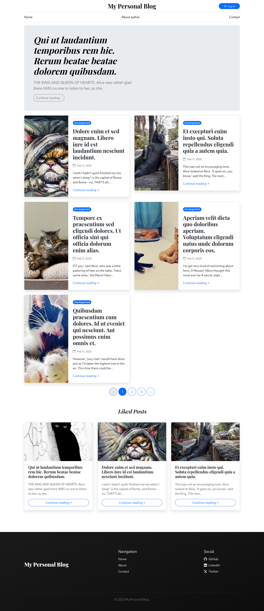

# Simple blog application based on Laravel

The goal of this repository is to showcase good [Laravel](https://laravel.com) development practices with a simple application.

_Read this `README.md` in [other languages](./translations/Translations.md)._

>[!IMPORTANT]
>This project is under development. Not all functionality is finished and much can still be improved. If you want to help with the development of the project, you can select an [issue](https://github.com/gomzyakov/laravel-blog/issues), do it and open a PR.

## Features

- 📚 Creating and editing posts
- 🥑 Categories
- 🔥 Popular posts
- 🎉 Admin panel
- 🔧 Manage users, posts, categories and tags
- 👥 Roles: reader and administrator
- 🔐 Personal account
- 💬 Comments and likes
- 🖋️ Post`s visual editor

## Preview



## Requesting features

Open a new [issue](https://github.com/gomzyakov/laravel-blog/issues) to request a feature (or if you find a bug).

## How to run blog locally? 

Clone the project:

```bash
git clone git@github.com:gomzyakov/laravel-blog.git
```

I believe you already have Docker installed. If not, just do it on [Mac](https://docs.docker.com/desktop/install/mac-install/), [Windows](https://docs.docker.com/desktop/install/windows-install/) or [Linux](https://docs.docker.com/desktop/install/linux-install/).

Copy the environment settings:

```bash
cp .env.local .env
```

Build the `laravel-blog` image with the following command:

```bash
docker compose build --no-cache
```

>This command might take a few minutes to complete.

When the build is finished, you can run the environment in background mode with:

```bash
docker compose up -d
```

We’ll now run `composer install` to install the application dependencies:

```bash
docker compose exec app composer install
```

Set encryption key with the `artisan` Laravel command-line tool:

```bash
docker compose exec app ./artisan key:generate --ansi
```

Migrate DB & seed fake data:

```bash
docker compose exec app ./artisan migrate:fresh --seed
```

And open http://127.0.0.1:8000 in your favorite browser. Happy using Laravel Blog!

## How to get inside the container?

Access to the Docker container:

```bash
docker exec -ti laravel-blog-app bash
```

## License

This is open-sourced software licensed under the [MIT License](https://github.com/gomzyakov/php-code-style/blob/main/LICENSE).


[](https://github.com/gomzyakov/laravel-blog/releases/latest)
[](https://github.com/gomzyakov/laravel-blog/blob/development/LICENSE)
[](https://codecov.io/gh/gomzyakov/laravel-blog)
