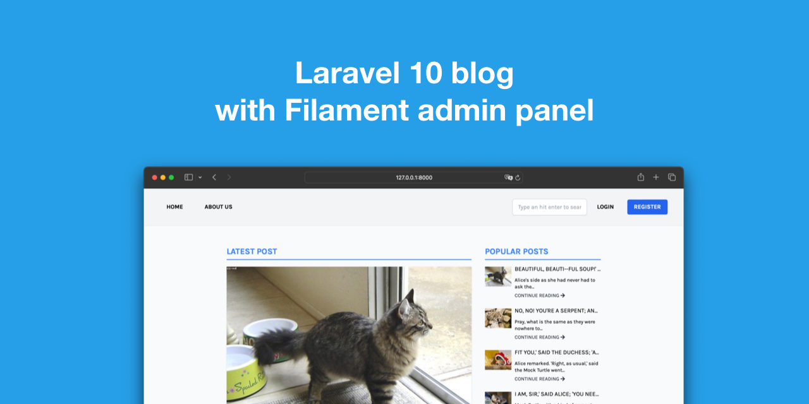

# Blog Laravel s skrbniško ploščo Filament

To je [Laravel](https://laravel.com) projekt začetnega kompleta blogov s skrbniško ploščo [Filament](https://filamentphp.com).

Cilj tega skladišča je predstaviti dobre razvojne prakse [Laravel](https://laravel.com) s preprosto aplikacijo.

## Lastnosti

- 📚 Ustvarjanje in urejanje objav
- 🥑 Kategorije
- :fire: Priljubljene objave
- :hatched_chick: Skrbniška plošča zgrajena na [Filament](https://filamentphp.com)

## Zahtevanje funkcij

Odprite [novo številko](https://github.com/gomzyakov/laravel-blog/issues/new), da zahtevate funkcijo (ali če najdete napako).

## Kako voditi blog lokalno?

Kloniraj projekt:

```bash
git klon git@github.com:gomzyakov/laravel-blog.git
```

Mislim, da že imate nameščen Docker. Če ne, to preprosto storite v [Mac](https://docs.docker.com/desktop/install/mac-install/), [Windows](https://docs.docker.com/desktop/install/windows -install/) ali [Linux](https://docs.docker.com/desktop/install/linux-install/).

Zgradite sliko `laravel-blog` z naslednjim ukazom:

```bash
docker compose build --no-cache
```

>Izvedba tega ukaza lahko traja nekaj minut.

Ko je gradnja končana, lahko zaženete okolje v načinu ozadja z:

```bash
docker sestavi -d
```

Zdaj bomo zagnali `composer install`, da namestimo odvisnosti aplikacije:

```bash
docker compose exec app composer install
```

Kopirajte nastavitve okolja:

```bash
docker compose exec app cp .env.local .env
```

Nastavite šifrirni ključ z orodjem ukazne vrstice `artisan` Laravel:

```bash
docker compose exec app ./artisan key:generate --ansi
```

Preseli lažne podatke DB in seme:

```bash
docker compose exec app ./artisan migrate:fresh --seed
```

In dodajte skrbniškega uporabnika Filament:

```bash
docker compose exec app ./artisan make:filament-user
```

In odprite http://127.0.0.1:8000 v svojem priljubljenem brskalniku. Srečna uporaba bloga Laravel!

## Kako priti v posodo?

Dostop do vsebnika Docker:

```bash
docker exec -ti laravel-blog-app bash
```

## Licenca

To je odprtokodna programska oprema, licencirana pod [licenco MIT](https://github.com/gomzyakov/php-code-style/blob/main/LICENSE).


[](https://github.com/gomzyakov/laravel-blog/releases/latest)
[](https://github.com/gomzyakov/laravel-blog/blob/development/LICENSE)
[](https://codecov.io/gh/gomzyakov/ laravel-blog)